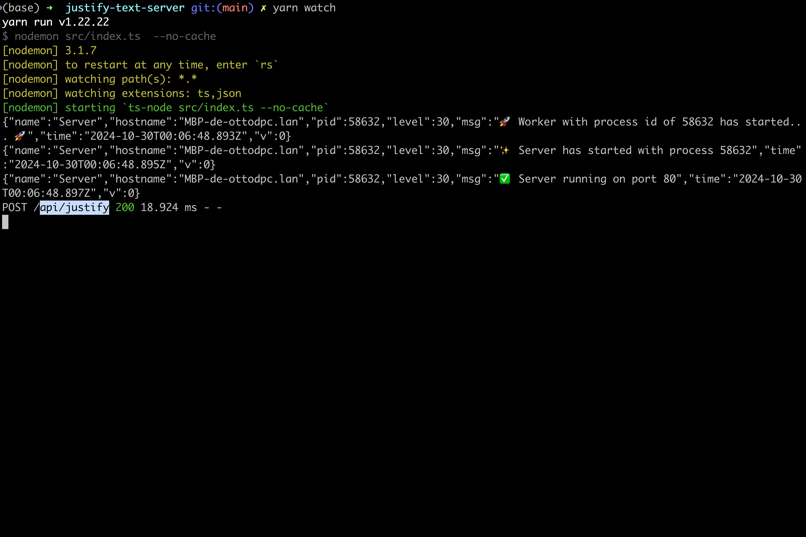
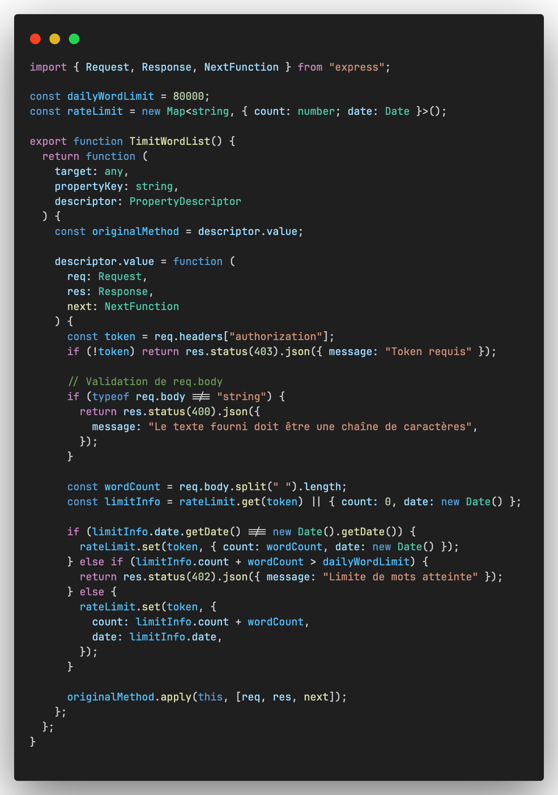

# 📜 Justification API

> **Remarque :** Ce projet a été conçu avec une approche modulaire. Consultez le dossier `img` pour des exemples de requêtes et de réponses dans Postman.

**Justification API** est une **API RESTful** construite avec **Node.js** et **TypeScript**, dédiée à la justification de texte en ligne de 80 caractères. Ce projet intègre des concepts avancés tels que l'authentification par token, la gestion de la limite de mots quotidienne par utilisateur et des pratiques de **Programmation Orientée Objet (OOP)** avec l'utilisation de **décorateurs** pour une architecture plus maintenable et modulable.


---

## 📋 Table des matières

- [📋 Prérequis](#prérequis)
- [📦 Installation](#installation)
- [⚙️ Configuration](#configuration)
- [🚀 Utilisation](#utilisation)
- [📚 Endpoints](#endpoints)
  - [🔐 /api/token](#api-token)
  - [📏 /api/justify](#api-justify)
- [🛠️ Détails de Justification](#détails-de-justification)
- [⚙️ Technologies Utilisées](#technologies-utilisées)
- [🏗️ Structure du Projet et Concepts Avancés](#structure-du-projet-et-concepts-avancés)
- [📸 Exemple d'utilisation](#exemple-dutilisation)

---

### 📋 Prérequis

- **Node.js** : [v22.1.0](https://nodejs.org/) ou supérieur
- **Yarn** : [v1.22.22](https://yarnpkg.com/) ou supérieur
- **Git** : [v2.40.1](https://git-scm.com/) ou supérieur

Le code source est disponible sur GitHub : [https://github.com/ottodpc/justify-text-server](https://github.com/ottodpc/justify-text-server)

---

### 📦 Installation

1. **Cloner le dépôt :**

   ```bash
   git clone https://github.com/ottodpc/justify-text-server.git
   cd justify-text-server
   ```

2. **Installer les dépendances :**

   ```bash
   yarn install
   ```

3. **Compiler le code TypeScript :**

   ```bash
   yarn build
   ```

4. **Démarrer le serveur :**
   ```bash
   yarn start
   ```

---

### ⚙️ Configuration

1. **Créer le fichier `.env`** en utilisant le modèle `.env.example` :
   ```bash
   cp .env.example .env
   ```
2. **Configurer la clé secrète** dans le fichier `.env` pour le token JWT :
   ```env
   SECRET_KEY="VOTRE_SECRET_KEY"
   ```

---

### 🚀 Utilisation

L'API offre deux principaux endpoints :

- `/api/token` : Pour obtenir un token d’authentification.
- `/api/justify` : Pour justifier un texte avec des lignes de 80 caractères.

Le dossier `img` contient des captures d'écran illustrant les tests Postman et le terminal lors des requêtes :




---

### 📚 Endpoints

#### 🔐 **/api/token**

- **Description** : Retourne un token JWT pour l'utilisateur.
- **Méthode** : `POST`
- **Content-Type** : `application/json`
- **Corps de la requête** :
  ```json
  {
    "email": "foo@bar.com"
  }
  ```
- **Réponse** :
  ```json
  {
    "token": "TOKEN"
  }
  ```

#### 📏 **/api/justify**

- **Description** : Justifie un texte envoyé dans le corps de la requête, avec une limite de ligne de 80 caractères.
- **Méthode** : `POST`
- **Content-Type** : `text/plain`
- **Headers** :
  - `Authorization: Bearer <votre_token>`
- **Corps de la requête** : Texte brut.
- **Réponse** :
  - **Code 200** : Texte justifié avec lignes de 80 caractères.
  - **Code 402** : Limite quotidienne de mots atteinte.
  - **Code 403** : Token non fourni.

Exemple de requête Postman :


---

### 🛠️ Détails de Justification

Le texte est justifié sans l'utilisation de bibliothèques externes pour la mise en forme. Les mots sont répartis uniformément sur des lignes de 80 caractères, ajoutant des espaces pour un alignement parfait. Des exemples sont fournis dans `input.txt` et `output.txt` pour illustrer la justification.

---

### ⚙️ Technologies Utilisées

- **[Node.js](https://nodejs.org/)** : Environnement JavaScript côté serveur.
- **[TypeScript](https://www.typescriptlang.org/)** : Superset de JavaScript ajoutant des types statiques pour une meilleure gestion des erreurs.
- **[Express](https://expressjs.com/)** : Framework pour construire des API RESTful.
- **[JSON Web Tokens (JWT)](https://jwt.io/)** : Utilisé pour sécuriser les endpoints via l'authentification par token.
- **[dotenv](https://github.com/motdotla/dotenv)** : Gère les variables d'environnement pour une configuration sécurisée.
- **[Jest](https://jestjs.io/)** : Framework de test pour tester les fonctionnalités de l'API.

---

### 🏗️ Structure du Projet et Concepts Avancés

Ce projet utilise une architecture modulaire, mettant en avant plusieurs concepts avancés en **Programmation Orientée Objet (OOP)** et en développement backend.

#### Décorateurs

Les **décorateurs** sont utilisés pour améliorer la lisibilité et la modularité du code. Par exemple :

- `@POST` : Décorateur pour définir une méthode comme une route POST.
- `TimitWordList` : Middleware pour limiter le nombre de mots quotidiens autorisés par token.
- **Exemple de Décorateur** : `TimeWordList`, qui gère les limites quotidiennes des mots par token utilisateur.



#### Gestion d'erreurs globale

Une gestion d'erreurs centralisée est implémentée pour capturer toutes les erreurs et retourner des réponses cohérentes au client.

#### Middleware de sécurité

Utilisation de bibliothèques comme **Helmet** et **Rate Limit** pour sécuriser l'application contre les attaques courantes.

#### Architecture modulaire

Le code est organisé de manière modulaire pour permettre une meilleure maintenabilité. Voici une capture de l’architecture du projet dans Visual Studio Code :


```
justify-text-server/
├── .env.example
├── img/
│   ├── justify/
│   │   ├── TERMINAL.png
│   │   └── POSTMAN.png
│   ├── token/
│   │   ├── TERMINAL.png
│   │   └── POSTMAN.png
│   └── decorators/
│       └── TimeWorList-Decorator.png
├── src/
│   ├── Controllers/
│   │   └── index.ts
│   ├── Decorators/
│   │   ├── body-validator.decorator.ts
│   │   ├── controller.decorator.ts
│   │   ├── route.decorator.ts
│   │   ├── throttle.decorator.ts
│   │   └── timit-words.ts
│   ├── Helpers/
│   │   └── index.ts
│   ├── Interfaces/
│   ├── Logs/
│   ├── Settings/
│   │   └── index.ts
│   ├── application.ts
│   ├── index.ts
│   └── server.ts
├── tests/
├── input.txt
├── output.txt
├── jest.config.js
├── package.json
├── README.md
├── tsconfig.json
└── yarn.lock
```

### Explication de la Structure

- **img/** : Contient les captures d'écran des tests et de l'architecture pour la documentation, organisées par catégorie.
- **src/** : Dossier source principal pour les fichiers TypeScript du serveur.
  - **Controllers/** : Logique de traitement des requêtes HTTP.
  - **Decorators/** : Contient les décorateurs utilisés pour ajouter des fonctionnalités aux routes (par ex., `TimeWordList`, validation).
  - **Helpers/** : Fonctions d'assistance et utilitaires.
  - **Interfaces/** : Définitions d'interfaces TypeScript pour des structures de données.
  - **Logs/** : Gestion des logs de l'application.
  - **Settings/** : Configuration et réglages de l'application.
  - **index.ts** : Point d'entrée principal du serveur.
  - **application.ts** et **server.ts** : Fichiers principaux pour configurer et démarrer l'application Express.
- **tests/** : Dossier contenant les tests de l'application.
- **input.txt** et **output.txt** : Exemples de fichiers d'entrée et de sortie pour la justification de texte.
- **jest.config.js** : Configuration de Jest pour les tests.
- **tsconfig.json** : Configuration TypeScript pour le projet.

---

### 📸 Exemple d'utilisation

1. **Générer un token** avec l'endpoint `/api/token`.
2. **Justifier un texte** avec l'endpoint `/api/justify`, en incluant le token généré dans l’en-tête de la requête.
